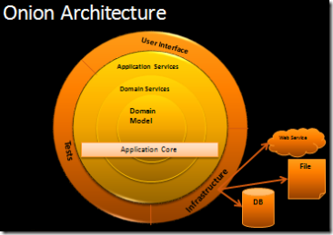
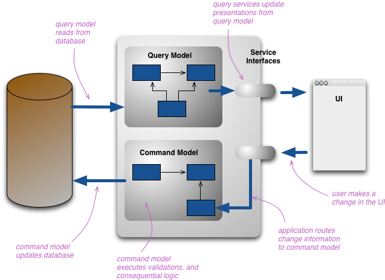
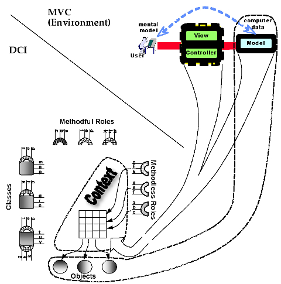

Software Architecture Design  
========  

Software Architecture Design，是一个很大的话题，也是每位工程师应该长期实践和思考，耳熟能详的：六边形架构、洋葱架构、三层架构、CQRS、DDD 都属于其的范畴。与之相关的还有一个话题：[Architectural Pattern](https://en.wikipedia.org/wiki/Architectural_pattern)。

架构学习有这几个非常好的学习资料：  

- [Linux/Unix设计思想](http://www.amazon.cn/gp/product/B007PYVKLC)  
- [Software Architecture Patterns](http://www.oreilly.com/programming/free/software-architecture-patterns.csp)  
- [The Architecture of Open Source Applications](http://www.aosabook.org/en/index.html)  
- [MSDN-Software Architecture and Design](https://msdn.microsoft.com/en-us/library/ee658093.aspx)  
- [Design pattern samples in Java](http://java-design-patterns.com/)  

个人感觉还是从：数据、数据流向、Input、Output 的维度去思考系统更简洁。

### 经典架构

在 [The Four Architectures that will inspire your programming](http://andrzejonsoftware.blogspot.no/2013/12/the-four-architectures-that-will.html) 这篇文章中，作者介绍了介绍了四种经典架构：  

- [The Hexagonal Architecture](http://alistair.cockburn.us/Hexagonal+architecture)  
- [The Clean Architecture](http://blog.8thlight.com/uncle-bob/2012/08/13/the-clean-architecture.html)  
- [DDD(Domain-driven design)](https://en.wikipedia.org/wiki/Domain-driven_design)/[CQRS](http://martinfowler.com/bliki/CQRS.html)  
- [DCI: Data Context Interaction](http://www.artima.com/articles/dci_vision.html)  

另一篇文章：[4 Great Programming Architectures You should Know](http://codecall.net/2014/01/28/4-great-programming-architectures-you-should-know/) 中也提到了这四种架构。

### DDD  

DDD 是 大神Eric Evans 于 2004 创立的一种软件设计和实现方式，至今仍非常火。它将软件开发分为两个阶段：  
- 以一种领域专家、设计人员、开发人员都能理解的通用语言作为相互交流的工具，在交流的过程中发现领域概念，然后将这些概念设计成一个领域模型；
- 由领域模型驱动软件设计，用代码来实现该领域模型；

个人感觉 DDD 更像是一种业务分析方法，帮助我们将业务需求转化为系统设计，并确立系统各个模块的职责和相互之间的交互机制，对做业务架构非常有帮助。为服务

**快速了解：**  

- [An Introduction to Domain Driven Design](http://www.methodsandtools.com/archive/archive.php?id=97)  
- [领域驱动设计和实践](http://kb.cnblogs.com/page/112298/)  
- [Domain Driven Design Quickly](http://www.infoq.com/cn/minibooks/domain-driven-design-quickly)  
- [DDD领域驱动设计基本理论知识总结](http://www.cnblogs.com/netfocus/archive/2011/10/10/2204949.html) 作者的 blog 中有不少 DDD 相关的文章  
－ [Domain-Driven Design in an Evolving Architecture](http://www.infoq.com/articles/ddd-evolving-architecture)  

**经典书籍**  

- [[PDF]Domain-Driven Design: Tackling Complexity in the Heart of Software - Eric Evans](http://www-public.tem-tsp.eu/~gibson/Teaching/CSC7322/ReadingMaterial/Evans03.pdf)  
- [[PDF]Implementing Domain-Driven Design - Vaughn Vernon](http://ptgmedia.pearsoncmg.com/images/9780321834577/samplepages/0321834577.pdf)  

在讨论 DDD 时，经常会听到：贫血模型、充血模型这两个概念，这里是一些相关资料：  
- [Anemic Domain Model - 贫血领域模型](http://www.martinfowler.com/bliki/AnemicDomainModel.html)  
- [Rich Domain Model - 充血模型](http://www.slideshare.net/chris.e.richardson/building-rich-domain-models)  
- [The Anaemic Domain Model is no Anti-Pattern, it’s a SOLID design](https://blog.inf.ed.ac.uk/sapm/2014/02/04/the-anaemic-domain-model-is-no-anti-pattern-its-a-solid-design/)  反击文 [Rich Domain Is SOLID , Anaemic Domain Is An Anti Pattern](http://blog.sapiensworks.com/post/2014/03/26/Rich-Domain-Is-SOLID-Anaemic-Domain-Is-An-Anti-Pattern.aspx/)
- [贫血，充血模型的解释以及一些经验](http://kb.cnblogs.com/page/520743/)  需要注意这篇文章对贫血模型的定义和标准的不一样
- [领域模型、贫血模型、充血模型概念总结](http://blog.csdn.net/zsy_gemini/article/details/9060105)  
- [关于架构设计的“贫血模型”与“充血模型”](http://www.cnblogs.com/magiccode1023/archive/2012/11/06/2756234.html)  
- [贫血模型or充血模型新的解决办法](http://www.iteye.com/topic/1114441)  

与 DDD 相关的还有一个概念：[四色原型](https://en.wikipedia.org/wiki/Object_Modeling_in_Color)。

### Hexagonal Architecture - 六边形架构  

由 Alistair Cockburn 在 2005 年提出：  
- 原文：http://alistair.cockburn.us/Hexagonal+architecture  
- 译文：http://blog.csdn.net/zhongjinggz/article/details/43889821  

这位大神非常高产，是 Agile Movement 的发起者之一，兴趣广泛，他有一篇文章还引用了汉字去解释它的观点：[守 – 破 – 離 – 心](http://alistair.cockburn.us/Shu+Ha+Ri)，很有意思。

这个架构很容易理解，也衍生出了多种变种，看 Intent、Motivation、Nature of the Solution  三节即可了解其思想，对组织代码、拆分系统非常有帮助，跟 Coding 强相关，即学即用，不容错过。它借鉴了 OS 中端口、设备的概念，通过识别一个系统中核心业务、外围实体，区分去可变和不可变成分。个人感觉感觉是对  Input -> Processor -> Output  的再深化。其中有两个重要概念：  

- PORT：应用对外部呈现的一组 API，对一类业务逻辑的封装  
- Adapter：实现 API 和外围实体的桥接

其难点在于：如何定义好编辑并识别 PORT。我的理解是：首先识别出应用自身（我的核心职责是什么）、服务方（外界通过什么服务来使用我）、依赖方（我依赖的服务），服务方、依赖方分别对应 port 和外围。

相关资料：  
- http://fideloper.com/hexagonal-architecture  
- http://c2.com/cgi/wiki?HexagonalArchitecture  
- http://culttt.com/2014/12/31/hexagonal-architecture/  
- http://www.infoq.com/news/2014/10/exploring-hexagonal-architecture  
- http://spin.atomicobject.com/2013/02/23/ports-adapters-software-architecture/  
- http://geekswithblogs.net/cyoung/archive/2014/12/20/hexagonal-architecturendashthe-great-reconciler.aspx  

### The Onion Architecture  

  

由 Jeffrey Palermo (Managing Partner/CEO, Microsoft MVP each year since 2006) 提出，原文： http://jeffreypalermo.com/blog/onion-architecture-part-4-after-four-years/  

Key tenets of Onion Architecture:  
- The application is built around an independent object model
- Inner layers define interfaces.  Outer layers implement interfaces
- Direction of coupling is toward the center
- All application core code can be compiled and run separate from infrastructure  

这个架构很容易理解，和六边形架构一脉相承，作者希望给大家提供一套标准的的模型和语言去描述系统。

### The Clean Architecture  

由 Uncle Bob （原名 Robert C. Martin，The Clean Coder 作者） 提出的一种架构：  
- 原文 http://blog.8thlight.com/uncle-bob/2012/08/13/the-clean-architecture.html  
- 译文 http://www.cnblogs.com/yjf512/archive/2012/09/10/2678313.html  

这位大叔写了很多文章，涉及我们日常听到的各种术语，这类是他的一些资源：
- 文章汇总： https://blog.8thlight.com/uncle-bob/archive.html  
- GitHub： https://github.com/unclebob  

它总结了多种架构的特点，抽象出其共性：  
- Independent of Frameworks. The architecture does not depend on the existence of some library of feature laden software. This allows you to use such frameworks as tools, rather than having to cram your system into their limited constraints.
- Testable. The business rules can be tested without the UI, Database, Web Server, or any other external element.
- Independent of UI. The UI can change easily, without changing the rest of the system. A Web UI could be replaced with a console UI, for example, without changing the business rules.
- Independent of Database. You can swap out Oracle or SQL Server, for Mongo, BigTable, CouchDB, or something else. Your business rules are not bound to the database.
- Independent of any external agency. In fact your business rules simply don’t know anything at all about the outside world.

这种架构可以看作六边形架构的衍生，和 The Onion Architecture 有异曲同工之妙 对组织大型应用很有参考价值。相关资料：  
- http://retromocha.com/obvious/  

### CQRS  

  

CQRS 由  Greg Young 提出，见文档 [CQRS Documents by Greg Young](https://cqrs.files.wordpress.com/2010/11/cqrs_documents.pdf)，视频 [Greg Young - CQRS and Event Sourcing](https://www.youtube.com/watch?v=JHGkaShoyNs)。思想很容易懂，是值得认真研究和掌握的一种架构，用的好的话对提高系统性能非常有帮助。

这里有大神 Martinfowler 的介绍：  
- 原文： http://martinfowler.com/bliki/CQRS.html  
- 译文： http://www.tuicool.com/articles/7BVjie  

Martinfowler 是系统设计领域的大师，ThoughtWorks 的首席科学家，有非常多的文章在流传，他的网站干货满满： http://www.martinfowler.com/  

CQRS 相关资料：  
－ [CQRS, Event Sourcing, and Domain Driven Design FAQ](http://cqrs.nu/)  
- [CQRS revisited](https://lostechies.com/gabrielschenker/2015/04/07/cqrs-revisited/)  
- [When NOT to use CQRS?](https://abdullin.com/post/when-not-to-use-cqrs/) 比较难得的是这是 [Lokad.CQRS Framework](http://lokad.github.io/lokad-cqrs/) 的作者实践后给出的建议  
- [Types of CQRS](http://enterprisecraftsmanship.com/2015/04/20/types-of-cqrs/)  
- [对CQRS的一次批判性思考](http://www.infoq.com/cn/news/2015/07/cqrs-critical-view)  
- [CQRS的益处](http://www.infoq.com/cn/news/2015/05/cqrs-advantages)  
- [CQRS is too complicated](http://codeofrob.com/entries/cqrs-is-too-complicated.html)  
- [浅谈命令查询职责分离(CQRS)模式](http://www.cnblogs.com/yangecnu/p/Introduction-CQRS.html)  
- [Clarified CQRS](http://udidahan.com/2009/12/09/clarified-cqrs/) [译文](http://liuzhaodong89.iteye.com/blog/1930310)  

### DCI  

  

由 [Trygve Reenskaug -The inventor of the MVC pattern](http://folk.uio.no/trygver/) and James O. Coplien 提出：  
- 原文：http://www.artima.com/articles/dci_vision.html  
- 视频：https://www.youtube.com/watch?v=SxHqhDT9WGI  

核心概念：  
- The data, that live in the domain objects that are rooted in domain classes;
- The context that brings live objects into their positions in a scenario, on demand;
- The interactions, that describe end-user algorithms in terms of the roles, both of which can be found in end users' heads.

感觉这个架构和具体怎么 coding 相关，不像是软件架构了。属于 OO 体系下衍生出来的一种模型，希望解决 MVC 架构和传统 OO 的一些问题，ruby 似乎挺关注这个架构的。偏理论+学术化，概念还比较容易理解，对解决 DDD 中 Application Core 如何设计有借鉴意义。

相关资料：  

- [Data Context Interaction: The Evolution of the Object Oriented Paradigm](http://www.sitepoint.com/dci-the-evolution-of-the-object-oriented-paradigm/)  
- [DCI Documentation](http://folk.uio.no/trygver/themes/babyide/baby-documents.html)  
- [DCI - The End User Architecture](http://mikepackdev.com/dci) 讲得比较清晰  
- [DCI: Re-thinking the foundations of object orientation and of programming](http://oredev.org/videos/dci--re-thinking-the-foundations-of-oo)  
- [FullOO](http://fulloo.info/)  专门介绍 DCI 及其实践  
- [DCI in Ruby](http://dci-in-ruby.info/) 作者 [Victor Savkin](http://victorsavkin.com/)  是 Angular team 成员，研究多种语言  
- [DCI: The Right Idea for the Wrong Paradigm](https://tonyarcieri.com/dci-in-ruby-is-completely-broken)  
- [DCI Architecture – Good, not Great, or Both?](http://pettermahlen.com/2010/09/10/dci-architecture-good-not-great-or-both/)  
- [DCI架构是什么](http://www.jdon.com/37976)  

感觉 DCI 是在从数据的角度来思考系统，似乎又回到了经典的：数据 -> 处理器 -> 函数调用模型。

### Ext 

#### Java 实践  

**Apache Zest**  
http://zest.apache.org/  
Apache Zest™ is a community based effort exploring Composite Oriented Programming for domain centric application development. This includes evolved concepts from Aspect Oriented Programming, Dependency Injection and Domain Driven Design. Composite Oriented Programming allows developers to work with 'fragments', smaller than classes, and 'compose' fragments into larger 'composites' which acts like the regular objects.

**Design pattern samples in Java**  
http://java-design-patterns.com/  
Design patterns are formalized best practices that the programmer can use to solve common problems when designing an application or system. Design patterns can speed up the development process by providing tested, proven development paradigms.

#### JavaScript 实践

[What the Flux? (On Flux, DDD, and CQRS)](http://jaysoo.ca/2015/02/06/what-the-flux/)  
[Domain-Driven JavaScript Development](http://www.slideshare.net/bobholt/ddd-17779078)  
[Building JavaScript applications based on DDD, CQRS and EventSourcing](http://www.slideshare.net/jbsen/mvc-evolved)  
[Microservices in Node.js using Event Sourcing and CQRS](http://slides.com/stefankutko/nodejs-microservices-event-sourcing-cqrs)  

**cqrs-domain**  
http://cqrs.js.org/pages/domain.html  
https://github.com/adrai/node-cqrs-domain  
Node-cqrs-domain is a node.js module based on nodeEventStore that. It can be very useful as domain component if you work with (d)ddd, cqrs, eventdenormalizer, host, etc.

**DDD-CQRS-Actor framework for javascript**  
https://github.com/liangzeng/cqrs  

**eventstore**  
https://github.com/adrai/node-eventstore  
Node-eventstore is a node.js module for multiple databases. It can be very useful as eventstore if you work with (d)ddd, cqrs, eventsourcing, commands and events, etc.

- 